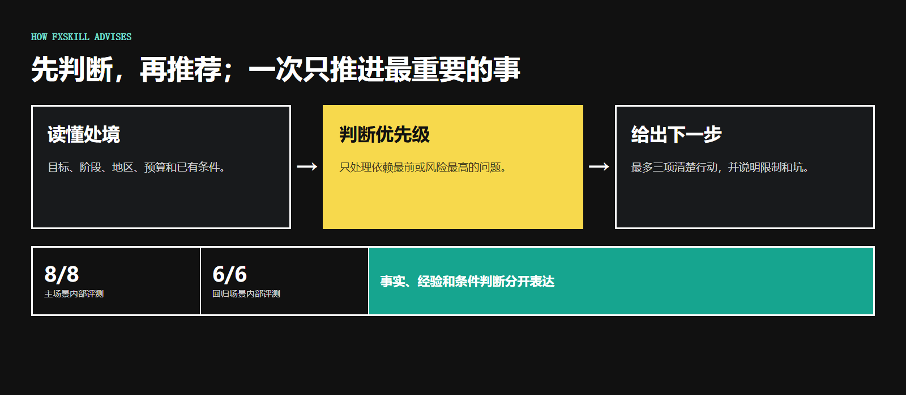
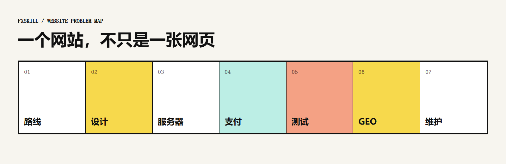

<p align="center">
  
</p>

# fxskill

> 不懂建站，也能知道现在先解决什么、为什么，以及去哪里找可靠资源。

[](LICENSE)


`fxskill` 是给建站新手的网站顾问。它不替你操作，也不冷冰冰地丢一堆链接，而是结合你的阶段、地区和目标，判断当前最重要的问题。

[一分钟开始](#一分钟开始) · [能帮什么](#它解决什么问题) · [具体问题](#直接问具体问题) · [安装](#安装与兼容性) · [评测](#评测与边界)

## 一分钟开始

```bash
npx -y skills add Fangx-AI/fxskill -g --all
```

```text
$fxskill 我想做一个付费内容网站，但不懂服务器、支付和备案，应该先确认什么？
```

## 它解决什么问题

| 你遇到的问题 | fxskill 给你的结果 |
| --- | --- |
| 想做网站，但不知道选官网、博客、电商还是 SaaS | 网站类型判断和当前优先级 |
| 页面看起来不专业，不知道从哪里改 | 页面目标、信息层级和设计资源 |
| 不懂域名、服务器、CDN 和网站发布 | 适合当前项目的服务器与发布路线 |
| 想收费，但不清楚个人、个体户和公司的区别 | 支付资格、限制、成本和核验入口 |
| 网站上线了，却搜不到或没有 AI 引用 | SEO 与 GEO 的共同基础和分流建议 |
| 担心移动端、支付流程、安全或速度出问题 | 上线前测试、备份和性能检查重点 |

## 它怎样给建议



它先读懂你的处境，再选择依赖最前或风险最高的一件事，最后给出不超过三项的清楚行动。需要核验的信息会说明来源和适用条件，不把个案当成通用答案。

## 网站问题地图



## 直接问具体问题

```text
$fxskill 支付：我是中国大陆个人，想做付费内容网站，第一步先确认什么？
$fxskill 设计：我的 AI 工具首页像模板站，最应该先改哪里？
$fxskill 服务器：Vibe Coding 做好的网站应该放在哪里？
$fxskill SEO：网站上线一个月还没有被收录，先检查什么？
$fxskill GEO：怎样让 AI 更容易理解和引用我的网站？
```

## 安装与兼容性

通过开放的 `skills` CLI 安装到支持 Agent Skills 的客户端：

```bash
npx -y skills add Fangx-AI/fxskill -g --all
```

在 Codex 中使用 `$fxskill`。其他兼容客户端按各自的 Skill 入口调用。

<details>
<summary>手动安装</summary>

```bash
git clone https://github.com/Fangx-AI/fxskill.git
```

将 `skills/fxskill` 放入客户端支持的 Skills 目录。不同客户端的目录和调用方式可能不同，请以对应客户端文档为准。

</details>

## 评测与边界

- 当前仓库内部评测：主场景 `8/8`，回归场景 `6/6`。
- 场景、评分规则和原始结果保存在 [`tests/fxskill`](tests/fxskill)。这些是项目自带评测，不是第三方认证。
- `fxskill` 只负责调查、判断、解释和推荐，不替你注册主体、申请支付、修改代码、配置服务器或执行上线。
- 法律、税务、安全和平台审核等高风险问题会提供准备路径与官方入口，不代替当地专业意见。

## 项目结构

```text
skills/fxskill/   正式 Skill 与专题参考
tests/fxskill/    场景、评分规则和评测记录
docs/             README 视觉资产
```

## 贡献

欢迎提交 Issue 补充真实建站问题、失效来源和容易踩坑的场景。提交建议时请说明适用地区、用户类型和信息日期，避免把单一个案写成通用规则。

## 许可证

[MIT](LICENSE)
